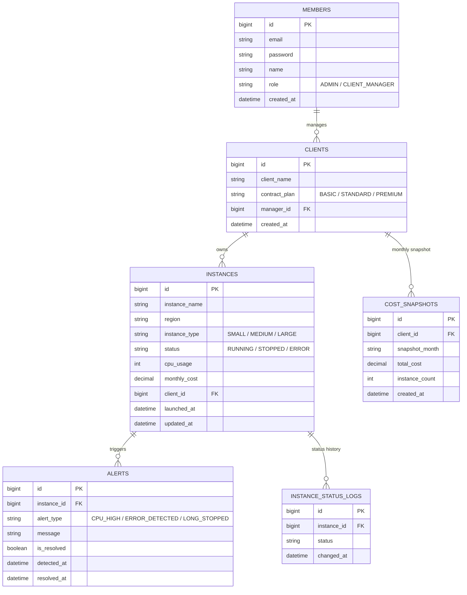

# ERD — Cloud Instance Monitoring System

## Diagram

## Design Rationale

**5 bảng theo đề bài gốc** (`members`, `clients`, `instances`, `alerts`, `cost_snapshots`) giữ nguyên đúng cấu trúc spec của TechValley.

**Bảng bổ sung: `instance_status_logs`**

Spec gốc chỉ lưu `status` hiện tại trên `instances`. Nhưng yêu cầu nghiệp vụ
*"SLA Uptime Calculation — tính tỷ lệ RUNNING time vs tổng giờ trong tháng"*
không thể tính được nếu chỉ biết trạng thái tức thời — cần biết **lịch sử** instance
đã RUNNING/STOPPED trong khoảng thời gian nào.

→ Thêm bảng ghi log mỗi lần `status` đổi (`instanceId`, `status`, `changedAt`).
SLA% sẽ được tính bằng cách cộng các khoảng thời gian RUNNING liên tiếp giữa các
log, chia cho tổng số giờ trong tháng.

Cách khác là không thêm bảng và suy ra uptime gần đúng từ `updatedAt`, nhưng sẽ
sai ngay khi instance đổi trạng thái nhiều lần trong cùng tháng — nên chọn ghi log
đầy đủ để đảm bảo tính đúng và có dữ liệu chứng minh khi giải thích logic.

**Vì sao `cost_snapshots` tách riêng khỏi `instances`:** chi phí thực tế là một
con số tổng hợp theo tháng cho từng client (không phải theo từng instance), và cần
giữ lại lịch sử các tháng trước để làm cost forecast — nếu tính lại từ đầu mỗi lần
gọi API sẽ tốn và không có dữ liệu để so sánh xu hướng.

**Quan hệ chính:**
- `members` 1—N `clients` (1 CLIENT_MANAGER quản lý nhiều client)
- `clients` 1—N `instances`
- `instances` 1—N `alerts`
- `instances` 1—N `instance_status_logs`
- `clients` 1—N `cost_snapshots`
